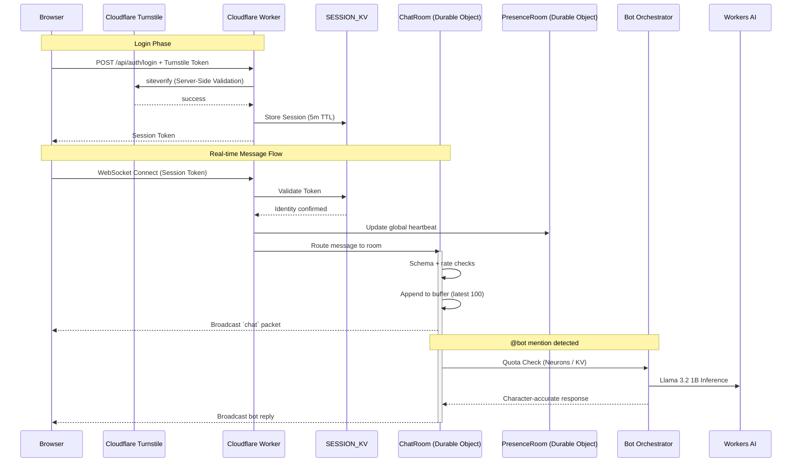

# CF Messenger: High-Level Design + Critical Audit

**Date:** 28 Jan 2026

**Keywords:** `Cloudflare Workers`, `Durable Objects`, `WebSockets`, `Workers AI`, `Workers Analytics Engine`, `KV`, `Turnstile`, `Web Analytics`, `Edge Computing`, `MSN Messenger`, `Real-time Chat`

---

## 1. Executive Summary

CF Messenger is an **Advanced Proof-of-Concept** reimagining what a classic messenger app could have looked like with modern tech. It pushes real-time chat entirely into Cloudflare’s edge mesh—where Durable Objects, Workers, SESSION_KV, and WebSockets collaborate to deliver an MSN-inspired UX while showcasing how stateful coordination can run without centralised servers. The emphasis is on **demonstrating capability** more than delivering production-grade durability, compliance, or offline guarantees.

**Capabilities verified:**

- Global, low-latency entry via Cloudflare Workers in 300+ cities.
- Session validation + presence orchestration inside SESSION_KV + Durable Objects with 5-minute TTLs.
- WebSocket multiparty routing without an external signaling layer or central Redis cluster.
- Bot interaction layer powered by Workers AI (Llama 3.2 1B) with circuit breakers for quota control (Neurons).
- **POC Context:** Configured for a **closed demo of ~30 concurrent users**, prioritizing stability and demo-reliability (1s persistence) over massive cost optimization.

**Deliberate POC exclusions:**

- Message durability or archival persistence.
- GDPR-grade deletion/retention workflows and audit logging (Turnstile is used as a processor).
- Enterprise MFA, CSRF protection (beyond Turnstile/SameSite), or cryptographic backplane separation.
- Offline delivery, acknowledgements, or guaranteed retries.

This document doubles as an audit. Every architectural claim includes evidence. Section 10 registers known failure modes, and Section 11 sketches what would be required to shift this stack to production readiness.

---

## 2. Historical Context & Architectural Evolution

### 2.1 Legacy Lessons (1999–2012)

MSN-era chat (MSNP) relied on a rigid, tiered centralised architecture:

- **Dispatch Servers (DS):** Acted as initial entry points and load balancers, redirecting clients to an available Notification Server.
- **Notification Servers (NS):** Managed persistent connections for presence updates, contact list synchronization, and session orchestration.
- **Switchboard Servers (SB):** Dedicated relays that hosted specific chat sessions and facilitated file transfers (P2P or relayed).

Each idle connection consumed RAM and stateful TCP sockets, requiring manual capacity planning for "peak hours." Latency hinged on client distance from regional data centres, and scaling was a vertical bottleneck—simply buying more physical iron. Every message relay through a Switchboard added a centralised point of failure.

### 2.2 Cloud 1.0 (2010–2023)

Most modern chat apps run on regional infrastructure (e.g., EC2/Kubernetes + Redis). Refactoring for this traditional model involves significant "glue logic" and operational overhead:

- **State Externalization:** Because servers are transient, all room state and participant lists must migrate from memory to an external **Redis cluster** or similar backplane.
- **Pub/Sub Orchestration:** To bridge users connected to different server instances, the backend must implement a Pub/Sub layer. Sending a message involves: `Client -> Server A -> Redis -> Server B -> Target Client`.
- **Sticky Sessions & Load Balancing:** Maintaining WebSocket stability requires complex ALB/NLB configurations and sticky sessions to prevent constant disconnects during autoscaling.
- **Scaling Lag:** Reactive autoscaling for long-lived TCP connections is slow; spinning up new instances during a spike typically takes minutes, leading to connection drops.
- **Latency Multipliers:** Every message incurs multiple network hops between regional compute, the session store, and the Pub/Sub bus, often adding 100ms+ of overhead compared to edge-native delivery.

### 2.3 Cloud 2.0 (Today)

CF Messenger flips the model by adopting an **"Edge Mesh"** architecture where compute and state coexist at the point of entry.

- **Isolate-Native State (Durable Objects):** Unlike Cloud 1.0, where state is pushed to a remote Redis cluster, CF Messenger uses Durable Objects to keep room state (active users, last 100 messages) in the same physical data centre as the connected users.
- **Global Mesh Routing:** Cloudflare’s backbone handles the routing between isolates. Messages never traverse the public internet or "central" regions; they move across a private global mesh, minimizing jitter and packet loss.
- **Hibernation-First Architecture:** By using the Hibernation API, Durable Objects can "sleep" while preserving the WebSocket connection. This shifts the cost model from _billing for idle time_ to _billing only for active compute_.
- **Zero Cold-Starts:** V8 isolates spin up in milliseconds using pre-warmed snapshots. A user clicking "Login" triggers a worker that is ready before the TLS handshake even completes.

### 2.4 The Grand Shift: Comparison Table

| Capability             | Legacy MSNP (On-Prem)                           | Cloud 1.0 (Regional Microservices)         | Cloud 2.0 (Edge Mesh / CF Messenger)            |
| :--------------------- | :---------------------------------------------- | :----------------------------------------- | :---------------------------------------------- |
| **User Latency**       | High (Regional DCs / Bottlenecks)               | Medium (Region-bound, Redis hops)          | Ultra-Low (Local entry, Isolate-native state)   |
| **Scalability**        | Manual (Rack & Stack)                           | Reactive (Autoscaling Groups / K8s)        | Instant (Automatic Isolate instantiation)       |
| **Cold Start**         | N/A (Always-on Iron)                            | 500ms - 2s (Container/VM Boot)             | <5ms (V8 Isolate snapshots)                     |
| **Operational "Glue"** | Proprietary proprietary hardware/load balancers | Redis, Pub/Sub, NLBs, VPC Peering, IAM     | None. State and compute are a single primitive. |
| **Cost (Idle)**        | High (Under-utilized hardware)                  | High (Billed for Connection-Minutes + RAM) | Near-Zero (Hibernation reclaims resources)      |
| **Data Residency**     | Physical (Where the building is)                | Regional (Where the Cloud Zone is)         | Mesh-Aware (`location_hint` pinning)            |

This evolution represents a shift from **managing infrastructure** to **composing edge primitives**, allowing us to recreate the MSN experience with a fraction of the original operational complexity and cost.

### 2.5 Why CF Mesh? (Competitor Comparison)

| Feature                | AWS Lambda + Firecracker / API Gateway      | Azure Durable Functions + Web PubSub        | GCP Cloud Run                                  | Cloudflare Durable Objects (CF Messenger)        |
| :--------------------- | :------------------------------------------ | :------------------------------------------ | :--------------------------------------------- | :----------------------------------------------- |
| **State Primitive**    | Stateless (Requires external DynamoDB) [^1] | Workflow Orchestration (Azure Storage) [^2] | Process-based (Ephemeral)                      | **Native persistence (Strongly Consistent)**     |
| **Cold Start**         | ~125ms - 1s (Micro-VM boot) [^3]            | Variable (depends on orchestration depth)   | 500ms+ (Container spin-up)                     | **<5ms (V8 Isolate snapshots)** [^4]             |
| **WebSocket Billing**  | $0.25 / 1M Connection-Minutes [^5]          | Per connection + egress                     | Billed for **continuous instance uptime** [^6] | **Request-based + Free Idle (Hibernation)** [^7] |
| **Global Topology**    | Regional Silos                              | Regional Silos                              | Regional Silos                                 | **Global Mesh (Native Edge Entry)**              |
| **Messaging Patterns** | External Redis/Dynamo required              | External Relay Required                     | External Pub/Sub required                      | **Single Object (Atomic Coordination)**          |
| **Identity/Auth**      | Complex IAM / Authorizers                   | Managed Identities / Auth0                  | Cloud IAM                                      | **Isolate-Native (Zod + KV)**                    |

#### The "Firecracker" vs "Isolate" Trade-off:

AWS Firecracker provides robust hardware-level isolation but incurs higher cold-start overhead (~125ms for the microVM alone) and requires managing many "moving parts" (Lambda + API Gateway + DynamoDB) to achieve the same stateful result. Cloudflare’s V8 Isolate approach allows us to treat **State + Compute + Network** as a single atomic unit, which is the primary driver for our MSN-level responsiveness.

---

[^1]: [AWS Lambda WebSocket State](https://aws.amazon.com/blogs/compute/announcing-websocket-apis-in-amazon-api-gateway/)

[^2]: [Azure Durable Task Provider](https://learn.microsoft.com/en-us/azure/azure-functions/durable/durable-functions-storage-providers)

[^3]: [Firecracker Boot Performance](https://github.com/firecracker-microvm/firecracker/blob/main/docs/design.md#boot-performance)

[^4]: [Eliminating Cold Starts](https://blog.cloudflare.com/eliminating-cold-starts-with-cloudflare-workers/)

[^5]: [AWS API Gateway Pricing](https://aws.amazon.com/api-gateway/pricing/)

[^6]: [GCP Cloud Run WebSocket Billing](https://cloud.google.com/run/docs/configuring/services/websockets#billing)

[^7]: [Durable Objects WebSocket Hibernation](https://blog.cloudflare.com/durable-objects-websocket-hibernation/)

---

## 3. Visual Architecture



_Omitted: reconnection flows, hibernation wake-ups, DO evictions, private room invitation workflows._

---

## 4. Storage Design & Data Model

CF Messenger avoids SQL. Instead:

- **SESSION_KV:** 5-minute TTL tokens, presence heartbeats, bot rotation metrics. Globally replicated; every edge ray can revalidate sockets.
- **Durable Objects (ChatRoom, PresenceRoom):** Handle broadcast logic, schema enforcement (Zod), and rate limiting with in-memory buffers.
- **Hibernation Mirror:** When a DO hibernates, the latest buffer is mirrored to KV for rapid bootstrapping.

| Entity   | Storage         | Key Attributes                                       |
| :------- | :-------------- | :--------------------------------------------------- |
| User     | Seeded list     | ID, persona, avatar, archetype hints                 |
| Session  | SESSION_KV      | SessionID, UserID, expiry, nonce, location hint (uk) |
| Message  | DO memory       | ID, RoomID, Sender, Type, Timestamp, Content         |
| Presence | SESSION_KV + DO | Status flag, last heartbeat, routing hint            |

Migration tooling flattens legacy “big block” blobs into granular keys and requires coordinated client upgrades to avoid schema drift (see Section 9). This pipeline is critical because DO buffers do not survive versioned schema switches without migration.

---

## 5. WebSocket Protocol

Every payload is JSON and validated via Zod.

**Primary message types:**

- `chat`: Text ≤ 2048 characters.
- `nudge`: Screen shake/alert limited to 3/10s.
- `wink`: Flash-style animated notifications keyed by `winkId`.
- `typing`: TTL-bound typing indicator (3 seconds).
- `presence`: Online/busy/away updates pushed to the PresenceRoom.

**Handlers & Constraints:**

- `NudgeHandler`: Rate-limited per user (3 per 10s).
- `TypingHandler`: Emits a forced `typing:false` after TTL to clear stale UI indicators.
- `WinkHandler`: Combines timestamps + `winkId` hashes to synchronise playback across clients.

Every handler returns Zod-validation failures before they reach durable state to prevent schema drift and injection.

---

## 6. Intelligence Layer

### 6.1 Persona Engine

Bots embody deterministic personas. Character definitions include vocabulary, punctuation quirks, and stylistic prompts hard-coded into the orchestrator.

### 6.2 Circuit Breaker

- **Daily quota:** 10,000 Worker AI interactions tracked in KV (eventually consistent).
- **Fallback:** When quota depletes, the bot emits “Bot is sleeping” and rejects new bot mentions.
- **Plan:** Migrate quota ledger to a dedicated Durable Object to prevent KV races.
- **Cost:** Workers AI billing is based on **Neurons** (an integrated unit of GPU output). ~1k Neurons ≈ 130 LLM responses. we strictly use `@cf/meta/llama-3.2-1b-instruct` for lowest influence cost in this POC. Production would upgrade to 8B+. _source: [Available Models](https://developers.cloudflare.com/workers-ai/models/)_

---

## 7. Security & Infrastructure Blueprint

### 7.1 Defence in Depth

1. **Session Tokens:** Randomly generated UUIDv4 tokens stored in `SESSION_KV` with 5-minute TTLs. Validated against user identity on every WebSocket connection.
   - _Note: HMAC-SHA256 was planned but replaced by KV-backed UUIDs for simpler revocation in this POC._
2. **Private Room Guards:** DM room IDs embed sorted participant hashes (`dm_userA____userB`). The Durable Object verifies the hash before accepting invites or broadcasting.
3. **Rate Limiting:** Sliding windows live inside each ChatRoom DO but sync aggregates to SESSION_KV. On conflict, the stricter (higher count) bucket applies.
4. **Transport & CORS:** TLS 1.3 enforced by Cloudflare; worker adds `Access-Control-Allow-Origin` matching configured frontends.
5. **Bot Protection (Turnstile):** Client-side Windows XP verification window gates the login UI. **Server-side validation** (`siteverify`) is enforced on the login endpoint.
6. **Content Safety:** Zod validation plus escaping every string before serialization prevents reflected XSS and injection attacks.

**Caveats:**

- Client clock skew beyond ±30s requires manual refresh; automated revalidation is on the backlog.
- Predictable room names remain a challenge. The next iteration will add per-room nonces stored in DO state.
- KV’s eventual consistency can nudge counters above limits (10+ messages/min) during edge fan-out; a centralised counter is on the roadmap. _Source: [KV consistency](https://developers.cloudflare.com/kv/concepts/how-kv-works/)_

**Intentional exclusions:**

- Audit logging is deferred (see Section 12.5).
- DO buffers remain plaintext. Production would add AES-256-GCM encryption before persistence.
- TLS cipher suites are managed through the Cloudflare dashboard, not within the worker.

### 7.2 Cloudflare Configuration (wrangler.jsonc)

| Setting               | Value                        | Significance                                                            |
| :-------------------- | :--------------------------- | :---------------------------------------------------------------------- |
| `compatibility_date`  | `2024-09-23`                 | Ensures stable V8 APIs                                                  |
| `compatibility_flags` | `nodejs_compat`              | Enables Buffer/process polyfills                                        |
| `durable_objects`     | `CHAT_ROOM`, `PRESENCE_ROOM` | Core state primitives.                                                  |
| `kv_namespaces`       | `SESSION_KV`                 | Session tokens + presence heartbeats (5-minute TTL)                     |
| `observability`       | `enabled = true`             | Tail logs + CPU/request metrics                                         |
| `vars`                | `TURNSTILE_SECRET_KEY`       | **Managed via Secrets** (`wrangler secret put`). Not committed to repo. |

Durable Object separation simplifies concurrency but increases cross-actor messaging. The eventual plan is to colocate presence metadata inside ChatRoom DOs to reduce handshake overhead.

---

### 7.3 Cloudflare Dashboard Rules (Wildcard Subdomain Configuration)

To protect multiple applications across subdomains (e.g., `messenger.cfdemo.link`, `app1.cfdemo.link`) that share a common API structure, apply these zone-wide rules. This configuration maximizes the **Cloudflare Free tier** (10 Custom Rules, 1 Rate Limit Rule).

#### A. WAF Custom Rules (Security > WAF > Custom Rules)

1.  **Zone-Wide Login Protection**
    - **Goal:** Block non-browser/unauthorised login attempts across ALL subdomains.
    - **Expression:** `(http.request.uri.path eq "/api/auth/login" and http.request.method eq "POST" and not http.referer contains "cfdemo.link")`
    - **Action:** `Block` or `Managed Challenge`
    - _Significance: By checking for `cfdemo.link` in the referer, this rule allows legitimate logins from any of your subdomains while blocking direct bot attacks._

2.  **Universal API Guard**
    - **Goal:** Block access to system/admin endpoints across the entire zone.
    - **Expression:** `(http.request.uri.path contains "/api/ws/room/system_" or http.request.uri.path contains "/api/ws/room/admin_")`
    - **Action:** `Block`

3.  **Global Hygiene (Shared)**
    - **Goal:** Block automated scanners for all subdomains.
    - **Expression:** `(http.user_agent contains "curl" or http.user_agent contains "python" or http.user_agent contains "Go-http-client")`
    - **Action:** `Block`

#### B. Rate Limiting Rules (Security > WAF > Rate Limiting)

_Note: You have **1 rule** for the whole zone. Since your apps share an API structure, a single rule protects them all simultaneously._

1.  **Multi-App Throttling**
    - **Goal:** Prevent brute-force logins on ALL subdomains.
    - **Expression:** `(http.request.uri.path eq "/api/auth/login" and http.request.method eq "POST")`
    - **Characteristics:** Same IP
    - **Period:** 10 Seconds
    - **Requests:** 5
    - **Action:** `Block` for 1 Minute
    - _Note: This rule applies globally to any subdomain matching the path, effectively protecting your entire ecosystem with one slot._

#### C. Bot Fight Mode & Turnstile

- **Bot Fight Mode:** Enable (Security > Bots). This runs before custom rules and blocks known head-less browsers zone-wide.
- **Turnstile Managed Challenge:** Create a single Turnstile widget for `*.cfdemo.link`. This allows you to use the same security validation across all your subdomains seamlessly.

---

## 8. Cost, Scalability & Compliance

### 8.1 Cost Optimization (Hibernation)

Cloudflare’s Hibernation API releases the isolate while keeping session metadata (~1 KB) in KV. Idle connections are therefore cheap.

- Wake-up adds 100–500ms latency as the isolate reloads.
- The DO’s message buffer (100 entries) survives unless the isolate is evicted entirely.
- High churn may cancel savings because repeated wake cycles consume CPU and KB-level writes.

### 8.2 Data Residency & Compliance (UK-only)

All DOs and KV are pinned to the UK via `location_hint` and `kv_namespaces` bound to UK data centres.

```jsonc
"durable_objects": {
  "bindings": [
    { "name": "CHAT_ROOM", "class_name": "ChatRoom", "location_hint": "uk" },
    { "name": "PRESENCE_ROOM", "class_name": "PresenceRoom", "location_hint": "uk" }
  ]
}
```

**Outstanding compliance work (POC still lacks):**

1. API for user deletion that also purges SESSION_KV, DO buffers, and snapshots.
2. Retention triggers to expire chat buffers after 90 days (or local legal obligations).
3. Audit logging (Cloudflare Logpush) covering critical KV/DO events.
4. Privacy policy updates describing UK-only residency, Turnstile data processing, and data deletion rights.

Until these exist, refer to CF Messenger strictly as a demo; the UK lock prevents egress but not legal obligations. See [Cloudflare Jurisdictions](https://developers.cloudflare.com/durable-objects/reference/data-location/) for compliance details.

---

## 9. Operational Playbook

- **Deployment:** `wrangler publish --env production` targets the production account; staging uses the default workspace.
- **Durable Object migrations:** Introduce new class versions, drain ongoing rooms, then switch bindings to avoid buffer loss.
- **Monitoring:** Tail logs during rollouts to detect schema drift, quota spikes, or unexpected errors.
- **Rollback:** Use `wrangler tail --latest` to observe errors and `wrangler publish --env staging` for quick circuit breaker.

---

## 10. Known Limitations & Failure Modes

1. **Message Durability (Improved):** ChatRoom DOs now flush to disk every **1 second**. While this drastically reduces data loss risk for demos, it is not "ACID compliance." A crash can still lose <1s of data.
2. **Session Expiry UX (Medium):** Tokens expire at 20 minutes (for inclusive "fat" buffer). Without auto-refresh modals, users may disconnect abruptly.
3. **Rate Limit Drift (Medium):** DO counters reset on reroutes. KV mirrors reduce the drift but do not guarantee absolute enforcement.
4. **Bot Quota Races (Low):** KV-based daily counters are eventually consistent. For a 30-user POC, this risk is negligible.
5. **DO Migration Loss (Medium):** Deploying new class definitions clears buffers unless data is persisted off-isolate.
6. **Missing Offline Delivery (Low):** Messages to offline clients are dropped; would require Cloudflare Queues for retries.
7. **Typing Indicator Race (Low):** TTL is 3 seconds; crashes can leave stale indicators. Clients emit a synthetic `typing:false` on reconnect.
8. **Presence Drift (Medium):** SESSION_KV TTLs can expire even while sockets remain open; the worker forces disconnects when tokens become invalid.
9. **Observability Gaps (Medium):** There are no dashboards for dropped messages or reconnect loops. Logpush + dashboards should be added before production.
10. **Resolved: Turnstile Bypass:** Server-side token validation is now enforced on the `/api/auth/login` endpoint.

---

## 11. What Production Would Require

1. **Durability:** Persist message buffers to Cloudflare R2/KV, add dedup logic, and replay buffers during DO warm-ups.
2. **Security:** Harden tokens, add CSRF protections, rotate secrets automatically, and encrypt DO/KV buffers at rest.
3. **Compliance:** Automate EU/UK data residency, provide deletion API, enforce retention, enable audit logging via Logpush, and publish GDPR notices.
4. **Offline Delivery:** Use Cloudflare Queues + acknowledgements to retry messages when clients reconnect.
5. **Observability & Runbooks:** Stream logs, alert on DO evictions or quota breaches, and maintain incident management playbooks.

---

## 12. Standard Edge API Specification (v1.0)

This section defines the unified API structure for all applications on the `*.cfdemo.link` zone. AI agents should use this as the master blueprint for cross-app consistency and WAF compatibility.

### 12.1 Request/Response Envelope

All endpoints MUST use a consistent JSON structure to facilitate automated parsing:

```typescript
type ApiResponse<T> = {
  success: boolean;
  data?: T;
  error?: { code: string; message: string };
  meta: { timestamp: number; requestId: string };
};
```

### 12.2 Endpoint Hierarchy

Standardized paths enable zone-wide WAF rules to protect multiple applications simultaneously while accommodating diverse app types (E-commerce, Gaming, Tools).

| Endpoint Root           | Method          | Use Case                                   | Primary Storage |
| :---------------------- | :-------------- | :----------------------------------------- | :-------------- |
| `/api/auth/login`       | `POST`          | Turnstile-gated session creation           | KV              |
| `/api/auth/me`          | `GET`           | Session validation/Profile fetch           | KV/D1           |
| `/api/data/:collection` | `GET/POST`      | Relational CRUD (Orders, Users, Items)     | D1              |
| `/api/ws/room/:id`      | `GET (Upgrade)` | Real-time synchronization (Carts, Lobbies) | Durable Object  |
| `/api/ws/presence`      | `GET (Upgrade)` | Real-time global presence tracking         | Durable Object  |

### 12.3 Provisioning Checklist (Multi-Purpose)

When creating any new application (e.g., `shop.cfdemo.link`, `game.cfdemo.link`), the following resource patterns ensure security and AI-readiness:

1.  **D1 Relational Guard**:
    - Use for persistent records (e.g., `ORDERS`, `INVENTORY`).
    - Prefix tables with app namespace: `SHOP_ORDERS`, `GAME_SCORES`.
2.  **KV Session Guard**:
    - Use for transient tokens and high-frequency preference reads.
    - Mandatory `expirationTtl: 1200` (20 mins).
3.  **Durable Object Synchronization**:
    - Use for **Atomic Multi-User State** (e.g., a shared whiteboard, a real-time leaderboard, or a collaborative editor).
    - WebSocket handlers MUST use `ctx.acceptWebSocket(server)` (Hibernation API) to minimize idle-compute billing.
    - Rate limits MUST be enforced at the entry point of the `webSocketMessage` handler.

### 12.4 Integrated WAF Shield (Shared Rule Slots)

By adhering to the `/api/` path structure, a single set of WAF rules protects the entire zone:

- **Custom Rule**: Challenge all POSTs to `/api/` lacking a `cfdemo.link` referer.
- **Rate Limit**: Hard cap of 10 requests/min for any endpoint matching `*/api/auth/login`.

---

## 13. Observability & Analytics

CF Messenger utilises a dual-layered analytics approach to monitor both browser-level performance and server-side business logic within the Cloudflare Free Tier.

### 13.1 Frontend: Cloudflare Web Analytics

Privacy-first, cookie-less tracking of Real User Monitoring (RUM) metrics.

- **Implementation**: A lightweight JavaScript beacon injected into `index.html`.
- **Metrics**: Page views, visit counts, referrers, and Core Web Vitals (LCP, FID, CLS).
- **Security**: Operates without collecting PII or utilizing browser fingerprinting.

### 13.2 Backend: Workers Analytics Engine

High-cardinality, time-series logging of custom application events.

- **Provider**: Cloudflare Workers Analytics Engine (Beta).
- **Free Tier Cap**: 100,000 data points written per day / 10,000 read queries per day.
- **Instrumented Events**:
  - `login_success`: Tracks successful authentication per user.
  - `message_sent`: (Planned) Volume of chat activity per room.
  - `ai_invocation`: (Planned) Bot interaction frequency for quota management.

### 13.3 Configuration

The system is configured in `wrangler.jsonc` via the `analytics_engine_datasets` binding. This allows for seamless SQL-based querying of application health and usage directly from the Cloudflare Dashboard.

---

## Summary: Scope, Gaps, and Next Steps

CF Messenger is intentionally a **demo** that highlights Cloudflare edge primitives. This HLD documents every capability alongside its trade-offs. Section 10 lists concrete failure modes, and Section 11 outlines what it would take to make this stack production-ready.

**Key takeaways:**

1. The architecture excels at low-latency, global WebSockets with no centralised signaling.
2. Durability, compliance, and observability are known gaps; stakeholders must accept the listed limitations before citing CF Messenger as a reference.
3. Production readiness demands durability persistence, hardened security, compliance automation, and observability runbooks (Section 11).

Use this document to understand both the capabilities and constraints of this Cloudflare-backed POC before evaluating it for broader deployment.
